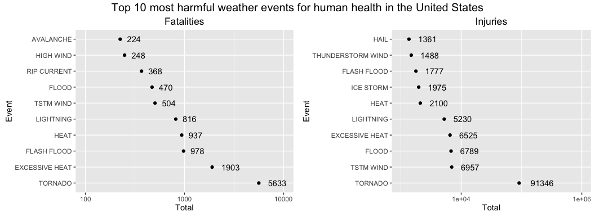
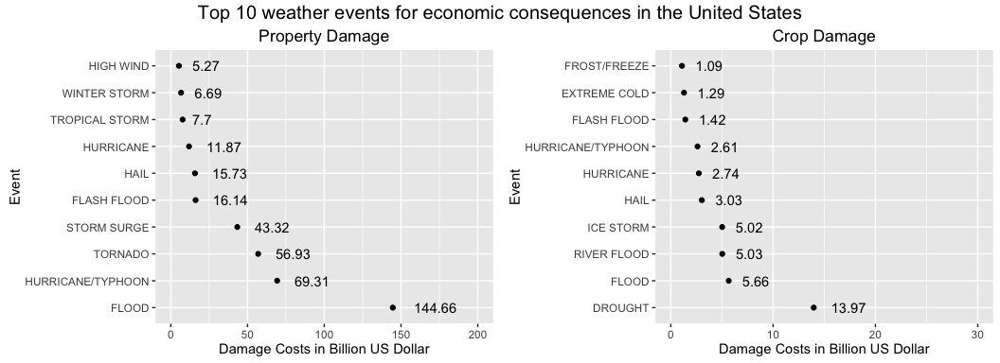

# Course Project 2
karow (GitHub)  

# Abstract
In this project the U.S. National Oceanic and Atmospheric Administration's (NOAA) storm database was analyzed. This database contains information about major weather events in the United States, including event type, times and locations. Overall goal of this project is to explore the event types that couse the majority of injuries/fatalities and property/crop damages.

# Data Processing
For this analysis the workign directory was set and four packages are needed to be loaded into R:


```r
setwd("~/Documents/Coursera/DataScience/5_Course/c5week4")
library(tidyr)
library(dplyr)
library(grid)
library(gridExtra)
library(ggplot2)
```

The data was loeaded into R and stored in the variabel NOAA. Subsequently, the variabel names of the data frame were converted to lower case to facilitate the analysis.


```r
NOAA <- read.csv('repdata%2Fdata%2FStormData.csv.bz2', na.strings = c('', 'NA'))
names(NOAA) <- tolower(names(NOAA))
```

This data frame contains 37 variabels of which only the following seven are needed:

* evtype
* fatalities
* injuries
* propdmg 
* propdmgexp
* cropdmg
* cropdmgexp


```r
names(NOAA)
```

```
##  [1] "state__"    "bgn_date"   "bgn_time"   "time_zone"  "county"    
##  [6] "countyname" "state"      "evtype"     "bgn_range"  "bgn_azi"   
## [11] "bgn_locati" "end_date"   "end_time"   "county_end" "countyendn"
## [16] "end_range"  "end_azi"    "end_locati" "length"     "width"     
## [21] "f"          "mag"        "fatalities" "injuries"   "propdmg"   
## [26] "propdmgexp" "cropdmg"    "cropdmgexp" "wfo"        "stateoffic"
## [31] "zonenames"  "latitude"   "longitude"  "latitude_e" "longitude_"
## [36] "remarks"    "refnum"
```
## Types Of Weather Events Most Harmful To Population Health

First, a subset of the data frame callef 'subHealth' is made containing the following variabels:

* evtype
* fatalities
* injuries


```r
subHealth <- subset(NOAA, select = c(evtype, fatalities, injuries))
head(subHealth)
```

```
##    evtype fatalities injuries
## 1 TORNADO          0       15
## 2 TORNADO          0        0
## 3 TORNADO          0        2
## 4 TORNADO          0        2
## 5 TORNADO          0        2
## 6 TORNADO          0        6
```

After taking a look at the new data subset 'subHealth', it is obvious that the column headers are values, instead of variable names. To tidy up the 'subHealth' data frame, the function gather() was used: 


```r
tidyHealth <- gather(subHealth, variable, counts, -evtype)
head(tidyHealth)
```

```
##    evtype   variable counts
## 1 TORNADO fatalities      0
## 2 TORNADO fatalities      0
## 3 TORNADO fatalities      0
## 4 TORNADO fatalities      0
## 5 TORNADO fatalities      0
## 6 TORNADO fatalities      0
```

To analyze which types of events are the most harmful to population health, the sum of all injuries/fatalities for each event type was calculated. The resulting local data frame was then converte into a normal data frame.


```r
sumHealth <- tidyHealth %>% group_by(evtype, variable) %>% summarise(sum = sum(counts))
sumHealth <- data.frame(sumHealth)
head(sumHealth)
```

```
##                  evtype   variable sum
## 1    HIGH SURF ADVISORY fatalities   0
## 2    HIGH SURF ADVISORY   injuries   0
## 3         COASTAL FLOOD fatalities   0
## 4         COASTAL FLOOD   injuries   0
## 5           FLASH FLOOD fatalities   0
## 6           FLASH FLOOD   injuries   0
```

Since the event types with the highest injuries/fatalities will be plotted in two separate plots, it is necessary to create two subgroups of the data frame, one containing the total counts of fatalities, and the second one containing the total counts of injuries.


```r
sumfatalities <- sumHealth %>% filter(variable == 'fatalities') %>% arrange(desc(sum)) %>% slice(1:10)
str(sumfatalities)
```

```
## 'data.frame':	10 obs. of  3 variables:
##  $ evtype  : Factor w/ 985 levels "   HIGH SURF ADVISORY",..: 834 130 153 275 464 856 170 585 359 19
##  $ variable: chr  "fatalities" "fatalities" "fatalities" "fatalities" ...
##  $ sum     : num  5633 1903 978 937 816 ...
```

```r
suminjuries <- sumHealth %>% filter(variable == 'injuries') %>% arrange(desc(sum)) %>% slice(1:10)
str(suminjuries)
```

```
## 'data.frame':	10 obs. of  3 variables:
##  $ evtype  : Factor w/ 985 levels "   HIGH SURF ADVISORY",..: 834 856 170 130 464 275 427 153 760 244
##  $ variable: chr  "injuries" "injuries" "injuries" "injuries" ...
##  $ sum     : num  91346 6957 6789 6525 5230 ...
```

The structure of the data reveals that the factors of the event type variabel 'evtype' needs to be reset to ensure that the data can be plotted in the desired order.


```r
sumfatalities$evtype <- factor(x = sumfatalities$evtype, levels = sumfatalities$evtype)
str(sumfatalities)
```

```
## 'data.frame':	10 obs. of  3 variables:
##  $ evtype  : Factor w/ 10 levels "TORNADO","EXCESSIVE HEAT",..: 1 2 3 4 5 6 7 8 9 10
##  $ variable: chr  "fatalities" "fatalities" "fatalities" "fatalities" ...
##  $ sum     : num  5633 1903 978 937 816 ...
```

```r
suminjuries$evtype <- factor(x = suminjuries$evtype, levels = suminjuries$evtype)
str(suminjuries)
```

```
## 'data.frame':	10 obs. of  3 variables:
##  $ evtype  : Factor w/ 10 levels "TORNADO","TSTM WIND",..: 1 2 3 4 5 6 7 8 9 10
##  $ variable: chr  "injuries" "injuries" "injuries" "injuries" ...
##  $ sum     : num  91346 6957 6789 6525 5230 ...
```

The results will be presented in the 'Results' section.

## Types Of Weather Events With Highest Economical Impact

As in the previous section described, the original data frame was subset into two data frames, subProp and subCrop, containing either the data for the property damage or for the crop damage.


```r
subProp <- subset(NOAA, select = c(evtype, propdmg, propdmgexp))
head(subProp)
```

```
##    evtype propdmg propdmgexp
## 1 TORNADO    25.0          K
## 2 TORNADO     2.5          K
## 3 TORNADO    25.0          K
## 4 TORNADO     2.5          K
## 5 TORNADO     2.5          K
## 6 TORNADO     2.5          K
```

```r
subCrop <- subset(NOAA, select = c(evtype, cropdmg, cropdmgexp))
head(subCrop)
```

```
##    evtype cropdmg cropdmgexp
## 1 TORNADO       0       <NA>
## 2 TORNADO       0       <NA>
## 3 TORNADO       0       <NA>
## 4 TORNADO       0       <NA>
## 5 TORNADO       0       <NA>
## 6 TORNADO       0       <NA>
```

The propdmgexp/cropdmgexp variable contains the information about the unit (K = thousand, M = million, B = billion) of the costs that are indicated in the propdmg/cropdmg variabel. To calculate the actual costs, the 'subProp' data frame was filtered for each unit and the costs indicated in propdmg were multiplied by 1,000, 1,000,000, or 1,000,000,000 and the results were stored in a varibel called 'costs'. Finally, the three data frames were concatenated using the function rbind(), to obtain a single data frame called 'PropTotal'.


```r
subPropK <- subProp %>% filter(propdmgexp == 'K') %>% mutate(costs = propdmg * 1000)
subPropM <- subProp %>% filter(propdmgexp == 'M') %>% mutate(costs = propdmg * 1000000)
subPropB <- subProp %>% filter(propdmgexp == 'B') %>% mutate(costs = propdmg * 1000000000)
PropTotal <- rbind(subPropK, subPropM, subPropB)
head(PropTotal)
```

```
##    evtype propdmg propdmgexp costs
## 1 TORNADO    25.0          K 25000
## 2 TORNADO     2.5          K  2500
## 3 TORNADO    25.0          K 25000
## 4 TORNADO     2.5          K  2500
## 5 TORNADO     2.5          K  2500
## 6 TORNADO     2.5          K  2500
```

The analysis process described in the previous paragraph was applied to the crop damage data as well and the final data frame was called 'CropTotal':


```r
subCropK <- subCrop %>% filter(cropdmgexp == 'K') %>% mutate(costs = cropdmg * 1000)
subCropM <- subCrop %>% filter(cropdmgexp == 'M') %>% mutate(costs = cropdmg * 1000000)
subCropB <- subCrop %>% filter(cropdmgexp == 'B') %>% mutate(costs = cropdmg * 1000000000)
CropTotal <- rbind(subCropK, subCropM, subCropB)
head(CropTotal)
```

```
##                    evtype cropdmg cropdmgexp  costs
## 1      THUNDERSTORM WINDS     500          K 500000
## 2      THUNDERSTORM WINDS      50          K  50000
## 3      THUNDERSTORM WINDS      50          K  50000
## 4                 TORNADO       5          K   5000
## 5                 TORNADO      50          K  50000
## 6 THUNDERSTORM WINDS/HAIL      15          K  15000
```

In the last step, the property/crop damage data was summarized to obtain the total costs for each event type and the factors for event type were reset. 


```r
SumPropTotal <- PropTotal %>% group_by(evtype) %>% summarize(totalCost = sum(costs)) %>% arrange(desc(totalCost)) %>% slice(1:10)
SumPropTotal$evtype <- factor(x = SumPropTotal$evtype, levels = SumPropTotal$evtype)
str(SumPropTotal)
```

```
## Classes 'tbl_df', 'tbl' and 'data.frame':	10 obs. of  2 variables:
##  $ evtype   : Factor w/ 10 levels "FLOOD","HURRICANE/TYPHOON",..: 1 2 3 4 5 6 7 8 9 10
##  $ totalCost: num  1.45e+11 6.93e+10 5.69e+10 4.33e+10 1.61e+10 ...
```

```r
SumCropTotal <- CropTotal %>% group_by(evtype) %>% summarize(totalCost = sum(costs)) %>% arrange(desc(totalCost)) %>% slice(1:10)
SumCropTotal$evtype <- factor(x = SumCropTotal$evtype, levels = SumCropTotal$evtype)
str(SumCropTotal)
```

```
## Classes 'tbl_df', 'tbl' and 'data.frame':	10 obs. of  2 variables:
##  $ evtype   : Factor w/ 10 levels "DROUGHT","FLOOD",..: 1 2 3 4 5 6 7 8 9 10
##  $ totalCost: num  1.40e+10 5.66e+09 5.03e+09 5.02e+09 3.03e+09 ...
```

The final results for the property and crop damage data are shown in the 'Result section.

# Results

## Types Of Weather Events Most Harmful To Population Health

In this section the processed data is visualized using ggplot2. The first figure shows two plots of the top 10 event types with the highest number of total fatalities (left plot) and injuries (right plot) in the United States. Since the numbers have a wide range a logarithmic scale was used to visualize the data.  


```r
plot1.1 <- ggplot(data = sumfatalities, aes(x = evtype, y = sum)) +
                geom_point() +
                coord_flip() +
                geom_text(aes(label=sum), hjust = -0.5) +
                scale_y_log10(limits = c(1e2,1e4)) +
                ylab('Total') +
                xlab('Event') +
                ggtitle('Fatalities')

plot1.2 <- ggplot(data = suminjuries, aes(x = evtype, y = sum)) +
        geom_point() +
        coord_flip() +
        geom_text(aes(label=sum), hjust = -0.5) +
        scale_y_log10(limits = c(1e3,1e6)) +
        ylab('Total') +
        xlab('Event') +
        ggtitle('Injuries')

plot1 <- grid.arrange(plot1.1, plot1.2, ncol = 2, top = textGrob('Top 10 most harmful weather events for human health in the United States', gp = gpar(fontsize = 15, font = 8)))
```

<!-- -->

## Types Of Weather Events With Highest Economical Impact

The second figure shows two plots of the top 10 event types with the highest costs for property damage (left plot) and crop damage (right plot) in the United States.  


```r
plot2.1 <- ggplot(data = SumPropTotal, aes(x = evtype, y = round(totalCost/1000000000, 2))) +
        geom_point() +
        coord_flip() +
        geom_text(aes(label= round(totalCost/1000000000,2), hjust = -0.5)) +
        ylim(limits = c(0,200)) +
        ylab('Damage Costs in Billion US Dollar') +
        xlab('Event') +
        ggtitle('Property Damage')

plot2.2 <- ggplot(data = SumCropTotal, aes(x = evtype, y = round(totalCost/1000000000, 2))) +
        geom_point() +
        coord_flip() +
        geom_text(aes(label= round(totalCost/1000000000,2), hjust = -0.5)) +
        ylim(limits = c(0,30)) +
        ylab('Damage Costs in Billion US Dollar') +
        xlab('Event') +
        ggtitle('Crop Damage')

plot2 <- grid.arrange(plot2.1, plot2.2, ncol = 2, top = textGrob('Top 10 weather events for economic consequences in the United States', gp = gpar(fontsize = 15, font = 8)))
```

<!-- -->
